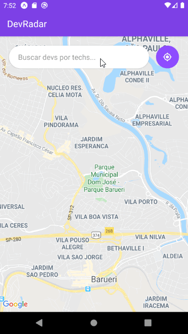

<h1 align="center">
  Semana Omnistack 10
</h1>

<p align="center">
  <a href="#-projeto">Project</a>&nbsp;&nbsp;&nbsp;|&nbsp;&nbsp;&nbsp;
  <a href="#rocket-tecnologias">Built With</a>&nbsp;&nbsp;&nbsp;|&nbsp;&nbsp;&nbsp;
  <a href="#-layout">Installation</a>&nbsp;&nbsp;&nbsp;|&nbsp;&nbsp;&nbsp;
  <a href="#-como-contribuir">Deployment</a>&nbsp;&nbsp;&nbsp;|&nbsp;&nbsp;&nbsp;
  <a href="#memo-licença">License</a>
</p>

<br>

# Project

Projeto DevRadar foi desenvolvido durante a Semana Omnistack 10 da Rocketseat (Jan/2020).

É um projeto que visa conectar desenvolvedores que trabalham com as mesmas tecnologias e que estejam próximos de você.

## Frontend


## Mobile

 
<!---  --->

<br/>

# Built With

Este projeto foi desenvolvido com as seguintes tecnologias:

- [Node.js](https://nodejs.org/en/)
- [React](https://reactjs.org/)
- [React Native](https://facebook.github.io/react-native/)
- [Expo](https://expo.io/)
- [Insomnia](https://insomnia.rest/download/)

<br>

# Installation

## Requirements

- Node
- Yarn
- Expo-cli

  ```
  yarn global add install expo-cli
  ```

- Mongoose DB

<br>

## Installation Steps

- Clone this repository

  ```
  git clone https://github.com/renanxr3/semanaomnistack10
  ```

- Install Backend dependencies

  ```
  cd omnistack10-backend
  yarn install
  ```

- Setup database connection (Mongoose)

  ```
  # In index.js change the URI with the details to connect to your Mongoose DB
  ```

- Install frontend dependencies

  ```
  cd omnistack10-frontend
  yarn install
  ```

- Install mobile dependencies

  ```
  cd omnistack10-mobile
  yarn install
  ```

- Change the backend IP address in Frontend and Mobile

  ```
  # Frontend:
  Change the IP address in src/services/api.js

  # Mobile:
  Change the IP address in src/services/api.js
  ```

<br>

# Deployment

## Backend

```
cd omnistack10-backend
yarn dev
```

## Frontend

```
cd omnistack10-frontend
yarn start
```

## Mobile

```
cd omnistack10-mobile
yarn start
```

<br/>

# Authors

- [Renan Santos](https://github.com/renanxr3)

<br/>

# License

This project is licensed under the [MIT License](LICENSE.md).

<br/>

# Acknowledgments

- [Rocketseat](https://rocketseat.com.br/)
- [Semana Omnistack 10 ](https://rocketseat.com.br/week-10/aulas)
